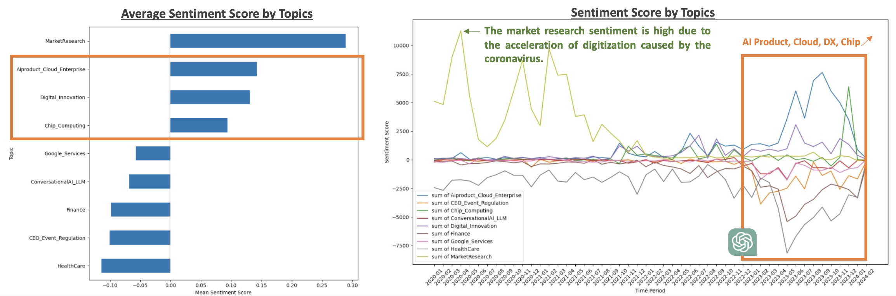

# Analysis of AI Trends in News Articles Using NLP

**University of Chicago - Natural Language Processing and Cognitive Computing Final Project**

## Purpose
The goal of the project is to extract valuable insights from approximately 200K AI-related news articles (about 900 MB) by utilizing NLP techniques, including Topic Modeling, Named Entity Recognition (NER), and Sentiment Analysis.

**For more details, please refer to [the presentation](slides/presentation.pdf).**

## Notebooks 
The `notebooks/` directory contains the Jupyter Notebooks used in this project. These notebooks include: 
-  **`1_cleaning.ipynb`**: Data cleaning and initial preprocessing. 
-  **`2_topicmodeling.ipynb`**: Topic modeling using ktrain.
-  **`3_ner.ipynb`**: Named Entity Recognition (NER) with spaCy.
- **`4_ner_manual.ipynb`**: Additional named entities using regex.
- **`5_sentiment.ipynb`**: Sentiment analysis with VADER and DistilBERT.
- **`6_summary.ipynb`**: Combining all analyses and summarizing results.

## Results
### Overall Sentiment Trend
- The news has been on a sharp increase since the end of 2022 (the drop in February 2024 is simply due to fewer data being collected). 
- The average sentiment score had been declining, but there was a rebound starting from 2023.  
- These trends are expected to be closely related to the release of ChatGPT at the end of November 2022.

### Sentiment Analysis by Topics
- After appearance of ChatGPT, sentiments for topics such as AI Product_Cloud_Enterprise, Digital_Innovation, and Chip_Computing have surged dramatically. 
- On the other hand, the scores for HealthCare and CEO_Event_Regulation have declined. In healthcare-related contexts, the presence of words such as ‘Cancer’ or ‘Kill’ may lead to a tendency for the sentiment to become negative. Therefore, it is necessary to verify whether the sentiment towards healthcare themes themselves is negative.
- It is evident that discussions related to regulation are prevalent in AI after the introduction of ChatGPT.
- Regarding Google_Services, while there is a high regard for the cloud, the low evaluation of Bard could potentially be a headwind for sentiment.

### Sentiment Analysis by Organizations
- The top positive sentiment organizations include IBM, Microsoft, Amazon, Facebook, and NVIDIA.
-  Looking at the scores of the top 5 over time, it is evident that concerns about Microsoft's Bing increased after the introduction of ChatGPT. However, the sentiment improved following news about Bing's enhancements.
-  Amazon saw a rise in sentiment due to the utilization of AI tools in its e-commerce services.
-  Regarding Facebook, there has been no significant change in sentiment, suggesting the possibility that it has not been able to ride the wave of GenAI.

### Sentiment Analysis by Products
- The top sentiments by product are SAP, Galaxy, Google Cloud, HPC (High-performance computing), and Discovery (Vertex AI Search by Google). Microsoft and Windows-related products also ranked highly.
-   SAP saw a rise in sentiment due to its collaboration with IBM on GenAI and LLMs.
-   There was increased focus on Galaxy AI and other smartphone and tablet technologies.
-   The sentiment towards GCP rose due to news of providing GenAI-related solutions to Singapore's MAS, MCI and other companies.
-   HPC gained attention as an essential computing resource for AI around the time of ChatGPT's release.

### Summary
- With the emergence of ChatGPT, the spotlight on companies, technologies, and sentiments shifted dramatically, necessitating a catch-up to the 'new trends.’ It is necessary to proceed with appropriate information gathering, capital investment, and technology implementation as described below.

